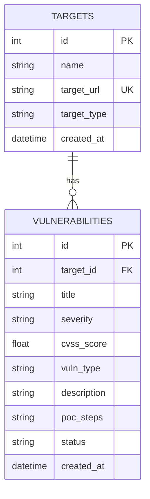

# SQL Code Analysis & Database Documentation

Bu belgede, **SecuLog Local** projesinde kullanılan SQLite veritabanı yapısı, tablolar arası ilişkiler ve kullanılan tüm SQL sorgularının detaylı analizi yer almaktadır.

---

## 1. Veritabanı Mimarisi (Database Architecture)

SecuLog Local, hafif ve yerel bir çözüm olan **SQLite** veritabanını kullanır.
Veritabanı dosyası: `vulnerabilities.db`

### ER Diyagramı (Basitleştirilmiş)



### 1.1 Tablo Yapıları

#### **Tablo: `targets` (Hedefler)**
Bu tablo, güvenlik testlerinin yapıldığı ana hedefleri tutar.

| Sütun Adı     | Veri Tipi | Kısıtlamalar (Constraints) | Açıklama                                      |
| :------------ | :-------- | :------------------------- | :-------------------------------------------- |
| `id`          | INTEGER   | PRIMARY KEY, AUTOINCREMENT | Benzersiz hedef kimlik numarası.              |
| `name`        | TEXT      | NOT NULL                   | Hedefin adı (örn: "X Şirketi Web").           |
| `target_url`  | TEXT      | UNIQUE                     | Hedefin URL'si veya IP adresi.                |
| `target_type` | TEXT      | -                          | Hedef tipi (örn: "web", "mobile", "network"). |
| `created_at`  | DATETIME  | DEFAULT CURRENT_TIMESTAMP  | Kayıt oluşturulma zamanı.                     |

#### **Tablo: `vulnerabilities` (Zafiyetler)**
Bu tablo, hedeflerde bulunan zafiyetleri saklar ve `target_id` ile `targets` tablosuna bağlıdır.

| Sütun Adı     | Veri Tipi | Kısıtlamalar (Constraints)         | Açıklama                                          |
| :------------ | :-------- | :--------------------------------- | :------------------------------------------------ |
| `id`          | INTEGER   | PRIMARY KEY, AUTOINCREMENT         | Benzersiz zafiyet kimlik numarası.                |
| `target_id`   | INTEGER   | FOREIGN KEY REFERENCES targets(id) | Hangi hedefe ait olduğunu belirtir.               |
| `title`       | TEXT      | NOT NULL                           | Zafiyetin başlığı (örn: "SQL Injection").         |
| `severity`    | TEXT      | NOT NULL                           | Kritiklik seviyesi (Critical, High, Medium, Low). |
| `cvss_score`  | REAL      | -                                  | CVSS puanı (0.0 - 10.0).                          |
| `vuln_type`   | TEXT      | -                                  | Zafiyet türü (örn: "Injection").                  |
| `description` | TEXT      | -                                  | Detaylı açıklama.                                 |
| `poc_steps`   | TEXT      | -                                  | Proof of Concept adımları.                        |
| `status`      | TEXT      | -                                  | Durum (örn: "Open", "Fixed").                     |
| `created_at`  | DATETIME  | DEFAULT CURRENT_TIMESTAMP          | Kayıt zamanı.                                     |

---

## 2. SQL Komut Analizi

### 2.1 Tablo Oluşturma (DDL)

Veritabanı başlatılırken (`initialize_tables()`) tabloların var olup olmadığı kontrol edilir (`IF NOT EXISTS`).

**Targets Tablosu Oluşturma:**
```sql
CREATE TABLE IF NOT EXISTS targets (
    id INTEGER PRIMARY KEY AUTOINCREMENT,
    name TEXT NOT NULL,
    target_url TEXT UNIQUE,
    target_type TEXT,
    created_at DATETIME DEFAULT CURRENT_TIMESTAMP
);
```
*   **Analiz:** `target_url`'in `UNIQUE` olması, aynı hedefin mükerrer eklenmesini engeller. `CURRENT_TIMESTAMP`, Python tarafında tarih göndermeden otomatik zaman damgası sağlar.

**Vulnerabilities Tablosu Oluşturma:**
```sql
CREATE TABLE IF NOT EXISTS vulnerabilities (
    id INTEGER PRIMARY KEY AUTOINCREMENT,
    target_id INTEGER,
    title TEXT NOT NULL,
    severity TEXT NOT NULL,
    cvss_score REAL,
    -- ... (diğer sütunlar)
    FOREIGN KEY (target_id) REFERENCES targets(id) ON DELETE CASCADE
);
```
*   **Analiz:** `ON DELETE CASCADE` çok önemlidir. Eğer bir "Target" silinirse, ona bağlı tüm "Vulnerability" kayıtları da otomatik olarak silinir. Bu, veritabanı bütünlüğünü korur ve öksüz (orphan) kayıtların oluşmasını engeller. SQLite'da bunun çalışması için bağlantı açılırken `PRAGMA foreign_keys = ON;` çalıştırılmalıdır.

---

### 2.2 Veri Okuma (SELECT)

**Tüm Hedefleri Listeleme:**
Kullanılan Yer: `show targets`, `get_targets_for_completion`
```sql
SELECT id, name, target_url, target_type FROM targets;
-- veya sadece ID ve Name:
SELECT id, name FROM targets;
```
*   **Analiz:** Basit bir `SELECT *` yerine sadece gerekli sütunların çekilmesi performans ve bellek yönetimi açısından daha iyidir.

**Zafiyetleri Hedef Bilgisiyle Listeleme (JOIN):**
Kullanılan Yer: `show vulns`
```sql
SELECT v.id, t.name, v.title, v.severity, v.cvss_score 
FROM vulnerabilities v
JOIN targets t ON v.target_id = t.id;
```
*   **Analiz:** `JOIN` işlemi, ilişkisel veritabanının gücünü gösterir. `vulnerabilities` tablosunda sadece `target_id` varken, kullanıcıya anlamlı bir çıktı vermek için bu ID, `targets` tablosundaki `name` sütunuyla eşleştirilir.

**Belirli Bir Hedefe Ait Zafiyetleri Çekme:**
Kullanılan Yer: `show all` (Tree View), `validation`
```sql
SELECT id, title, severity, cvss_score FROM vulnerabilities WHERE target_id=?;
```
*   **Analiz:** `WHERE` koşulu ile belirli bir üst kayda (target) ait alt kayıtlar (vulns) filtrelenir.

---

### 2.3 Veri Ekleme (INSERT)

**Yeni Hedef Ekleme:**
Kullanılan Yer: `add_target`
```sql
INSERT INTO targets (name, target_url, target_type) VALUES (?, ?, ?);
```
*   **Analiz:** Parametreli sorgu (`?`) kullanımı **SQL Injection** saldırılarını önlemek için zorunludur. Kullanıcı girdisi doğrudan sorgu içine string olarak eklenmez.

**Yeni Zafiyet Ekleme:**
Kullanılan Yer: `add_vuln`
```sql
INSERT INTO vulnerabilities (target_id, title, severity, cvss_score) VALUES (?, ?, ?, ?);
```

---

### 2.4 Veri Güncelleme (UPDATE)

**Hedef Güncelleme:**
Kullanılan Yer: `update_target`
```sql
UPDATE targets SET name=?, target_url=?, target_type=? WHERE id=?;
```
*   **Analiz:** Mevcut bir kaydı (`WHERE id=?`) verilen yeni değerlerle günceller. Yine parametreli sorgu kullanılır.

**Zafiyet Güncelleme:**
Kullanılan Yer: `update_vuln`
```sql
UPDATE vulnerabilities SET title=?, severity=?, cvss_score=? WHERE id=?;
```

---

### 2.5 Veri Silme (DELETE)

**Zafiyet Silme:**
Kullanılan Yer: `delete_vuln`
```sql
DELETE FROM vulnerabilities WHERE id = ?;
```

**Hedef Silme (Cascade Etkisi):**
Kullanılan Yer: `delete_target`
```sql
DELETE FROM targets WHERE id = ?;
-- Opsiyonel olarak, foreign key cascade çalışmazsa manuel temizlik:
-- DELETE FROM vulnerabilities WHERE target_id = ?;
```
*   **Analiz:** `db_manager.py` içinde `PRAGMA foreign_keys = ON` aktif edildiği ve tablo tanımlanırken `ON DELETE CASCADE` kullanıldığı için, sadece `targets` tablosundan silmek yeterlidir; SQLite ilgili zafiyetleri otomatik temizler. Ancak kod içerisinde güvenliği arttırmak adına bazen manuel silme işlemleri de görülebilir.

---

## 3. Güvenlik ve Performans Notları

1.  **SQL Injection Koruması:** Projedeki tüm sorgular Python'un `sqlite3` modülünün sağladığı parametre bağlama (`?` placeholder) özelliğini kullanır. Asla `f-string` ile sorgu oluşturulmaz.
2.  **Yabancı Anahtar (Foreign Key):** Veri bütünlüğü `FOREIGN KEY` kısıtlamaları ile veritabanı seviyesinde korunur.
3.  **İşlem Yönetimi (Transactions):** Veri yazma işlemleri (`INSERT`, `UPDATE`, `DELETE`) `conn.commit()` ile işlem sonlandırılana kadar geçicidir. Hata durumunda (try-except bloklarında) işlem yarım kalmaz ve veritabanı tutarlı kalır.
